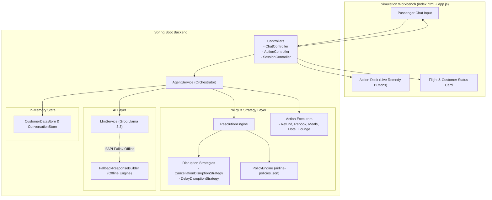

# SkyAssist AI - Airline Disruption Resolution Agent

A backend proof-of-concept built with Java, Spring Boot, and Groq LLM, demonstrating safe LLM integration for airline customer support. It combines an LLM for natural dialogue and empathy with a deterministic Java rules engine that enforces legal and financial policy compliance, preventing the AI from hallucinating promises or offering unauthorized compensation.

#### Demo : https://airline-customer-resolution-agent.onrender.com/
---


## The Actual Problem Being Solved

If you connect a raw LLM (like ChatGPT or Llama) directly to airline customer support, you have an immediate financial liability:

1. **Hallucination under pressure**: When an angry passenger whose flight is delayed says, *"Give me 50,000 rupees in cash and a First Class seat right now or I will post this everywhere"*, a standard conversational LLM will often apologize and agree just to de-escalate.
2. **Policy complexity**: Airline disruption rules (such as DGCA guidelines in India) have strict mathematical thresholds. A 2-hour delay gets nothing; a 3-hour delay gets food vouchers and lounge access; a 5-hour delay gets hotel accommodation; a cancellation gets a full refund or rebooking. LLMs are bad at strict rule-following when prompted directly.

### The Solution Used Here

**The LLM does NOT make policy decisions.**

1. The passenger sends a message.
2. The Java backend checks the passenger's actual flight data, delay minutes, and loyalty tier against the policy engine first.
3. The backend calculates the exact allowed remedies (e.g., `refund`, `meals`, `hotel`, `lounge`, `rebook`) and flags whether escalation is needed.
4. The backend injects these pre-computed boundaries into the LLM prompt.
5. The LLM only handles conversational phrasing, empathy, and explaining the airline's policy in clear language.
6. The backend exposes an `/api/action/execute` endpoint so approved remedies can be executed and tracked via unique reference codes.

---


## Architecture



### Turn-by-Turn Execution:
1. **User sends message**: POST `/api/chat` with `customerId`, `sessionId`, and `message`.
2. **Context retrieval**: Backend looks up the customer and their flight from `CustomerDataStore`.
3. **Deterministic evaluation**: `ResolutionEngine` evaluates whether the flight is delayed or cancelled and queries `airline-policies.json` for authorized remedies.
4. **Prompt construction**: The prompt sent to Groq includes the customer's PNR, tier, flight delay duration, and an explicit list of what can and cannot be offered.
5. **AI response + Action buttons**: The frontend receives the AI's explanation and automatically renders clickable buttons in the Action Dock for the authorized remedies.
6. **Action execution**: When the user clicks an action button (e.g., "Claim 100% Refund"), the frontend calls POST `/api/action/execute`. The backend runs the corresponding executor (`RefundActionExecutor`), updates the in-memory booking status, and returns a reference code.

---

## Engineering Design Patterns Used

* **Strategy Pattern for Disruption Evaluation**: `DisruptionStrategy` is an interface implemented by `CancellationDisruptionStrategy` and `DelayDisruptionStrategy`. If a new disruption type is added (e.g., baggage loss or flight diversion), it only requires adding a new strategy class without modifying existing engine logic.
* **Strategy Pattern for Remedy Execution**: Every remedy action (`refund`, `rebook`, `meals`, `hotel`, `lounge`) implements `ActionExecutor`.
* **Registry Pattern**: `ActionExecutorRegistry` automatically collects all `ActionExecutor` Spring beans on startup and dispatches action requests by name, avoiding long `if-else` or `switch` chains.
* **Deterministic Fallback (Graceful Degradation)**: If no Groq API key is configured, or if the Groq API experiences rate limits (HTTP 429) or network outages, `FallbackResponseBuilder` generates a clean, rule-accurate response. The application never crashes or presents error screens to the user.
* **Hot-Reloadable Configuration**: Policy rules, rupee limits, and delay hour thresholds are stored in `src/main/resources/airline-policies.json`. POSTing to `/api/policies/reload` refreshes the rules in memory without restarting the Spring Boot process.

---

## Repository Structure

```text
src/main/java/com/skyair/resolutionagent/
├── ResolutionAgentApplication.java    # Spring Boot application entry point
├── controller/
│   ├── ActionController.java          # POST /api/action/execute
│   ├── ChatController.java            # POST /api/chat
│   ├── HealthController.java          # GET /api/health
│   ├── PolicyController.java          # GET /api/policies, POST /api/policies/reload
│   └── SessionController.java         # GET /api/session/{id}, POST /api/session/reset/{id}
├── data/
│   ├── ConversationStore.java         # In-memory session history
│   └── CustomerDataStore.java         # 3 mock customer profiles and flights
├── model/                             # Enums (FlightStatus, LoyaltyTier) and DTOs
├── service/
│   ├── AgentService.java              # Coordinates chat turns, policy checks, and LLM calls
│   ├── FallbackResponseBuilder.java   # Rule-based generator when LLM is unavailable
│   ├── LlmService.java                # Client for Groq Chat Completions API
│   ├── PolicyConfigService.java       # Reads and reloads airline-policies.json
│   ├── PolicyEngine.java              # Evaluates tier-based logic and thresholds
│   └── ResolutionEngine.java          # Evaluates disruption strategies
└── strategy/
    ├── ActionExecutor.java            # Interface for remedy actions
    ├── ActionExecutorRegistry.java    # Dispatches actions to executors
    ├── CancellationDisruptionStrategy.java
    ├── DelayDisruptionStrategy.java
    ├── HotelDelayedHoursActionExecutor.java
    ├── LoungeAccessActionExecutor.java
    ├── MealVoucherActionExecutor.java
    ├── RebookActionExecutor.java
    └── RefundActionExecutor.java

src/main/resources/
├── airline-policies.json              # Configurable disruption rules and compensation limits
├── application.properties             # Port and Groq LLM model configuration
└── static/                            # Lightweight simulation UI (no build step needed)
    ├── app.js                         # Event listeners, API calls, Action Dock rendering
    ├── index.html                     # Simulation dashboard layout
    └── style.css                      # Clean dark-mode stylesheet
```

---

## How to Run It

### Prerequisites
* Java 21 or higher
* Maven 3.9+

### 1. Clone the repository
```bash
git clone https://github.com/suresh-jakhar/airline-customer-resolution-agent.git
cd airline-customer-resolution-agent
```

### 2.Set Groq API Key
If you have a Groq API key (free at console.groq.com), set it in your environment or a `.env` file:
```bash
export LLM_API_KEY="your_groq_api_key_here"
```


### 3. Build the project
```bash
mvn clean package -DskipTests
```

### 4. Run the application
```bash
java -jar target/customer-resolution-agent-1.0.0.jar
```

### 5. Open the Simulation Workbench
Open `http://localhost:8080` in any browser. Select any of the 3 passengers from the left panel dropdown to inspect their flight disruption and start testing chat scenarios.
